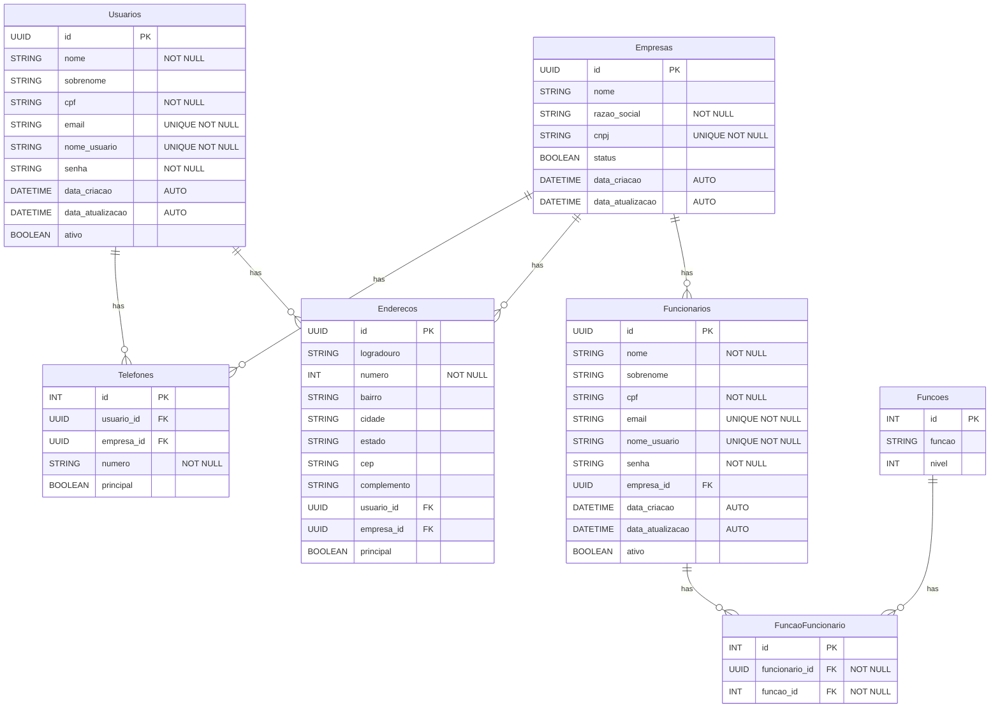

# Modelo de Classes - Gerenciador de Acesso

```mermaid
erDiagram
    Usuarios {
        UUID id PK
        STRING nome "NOT NULL"
        STRING sobrenome
        STRING cpf "NOT NULL"
        STRING email "UNIQUE NOT NULL"
        STRING nome_usuario "UNIQUE NOT NULL"
        STRING senha "NOT NULL"
        DATETIME data_criacao "AUTO"
        DATETIME data_atualizacao "AUTO"
        BOOLEAN ativo
    }
    Empresas {
        UUID id PK
        STRING nome
        STRING razao_social "NOT NULL"
        STRING cnpj "UNIQUE NOT NULL"
        BOOLEAN status
        DATETIME data_criacao "AUTO"
        DATETIME data_atualizacao "AUTO"
    }
    Enderecos {
        UUID id PK
        STRING logradouro
        INT numero "NOT NULL"
        STRING bairro
        STRING cidade
        STRING estado
        STRING cep
        STRING complemento
        UUID usuario_id FK
        UUID empresa_id FK
        BOOLEAN principal
    }
    Telefones {
        INT id PK
        UUID usuario_id FK
        UUID empresa_id FK
        STRING numero "NOT NULL"
        BOOLEAN principal
    }
    Funcionarios {
        UUID id PK
        STRING nome "NOT NULL"
        STRING sobrenome
        STRING cpf "NOT NULL"
        STRING email "UNIQUE NOT NULL"
        STRING nome_usuario "UNIQUE NOT NULL"
        STRING senha "NOT NULL"
        UUID empresa_id FK
        DATETIME data_criacao "AUTO"
        DATETIME data_atualizacao "AUTO"
        BOOLEAN ativo
    }
    Funcoes {
        INT id PK
        STRING funcao
        INT nivel
    }
    FuncaoFuncionario {
        INT id PK
        UUID funcionario_id FK "NOT NULL"
        INT funcao_id FK "NOT NULL"
    }
    Funcionarios ||--o{ FuncaoFuncionario : "has"
    Funcoes ||--o{ FuncaoFuncionario : "has"
    Empresas ||--o{ Telefones : "has"
    Usuarios ||--o{ Telefones : "has"
    Empresas ||--o{ Enderecos : "has"
    Empresas ||--o{ Funcionarios : "has"
    Usuarios ||--o{ Enderecos : "has"
```